# GeoTrace

> 让没有 GPS 的相机，也能拥有照片定位。

GeoTrace 是一款纯本地运行的 Android 摄影工具：用手机记录 GPS 轨迹，旅行结束后把相机照片按**拍摄时间**与轨迹匹配，自动把精确坐标写入照片 EXIF。无需云端、无需账号，默认生成副本，原片始终不动。

许多相机（单反、微单、部分卡片机）没有内置 GPS，导出的照片没有位置信息。GeoTrace 用你本来就会随身携带的手机解决这个问题：

```text
手机记录 GPS 轨迹
        ↓
正常使用相机拍照（无需改变任何拍照习惯）
        ↓
把相机照片添加到 GeoTrace
        ↓
读取照片 EXIF 拍摄时间
        ↓
按时间匹配 GPS 轨迹（二分定位 + 线性插值）
        ↓
每张照片得到精确拍摄位置，写入 EXIF
```

---

## 核心功能

- **GPS 轨迹记录**：前台服务持续记录，锁屏、切后台都不会中断；记录页实时显示高德轨迹地图、当前位置、时长、距离、定位点数、速度与定位精度。
- **GPX 轨迹导入 / 导出**：支持标准 GPX 1.1，可使用外部设备记录的轨迹，也可导出备份。
- **照片自动定位**：按 EXIF 拍摄时间匹配轨迹，支持相机/手机时钟偏移校准与「最大匹配时间」保护，超出范围的照片不会被强行写入错误位置。
- **原片安全**：默认输出带 GPS 的副本到 `Pictures/GeoTrace/Geotagged/`；也可选择覆盖原照片（两阶段安全写入）。
- **手动调整位置**：地图点选 + 地点关键词搜索（POI）+ 逆地理编码，匹配失败或想修正时可手动定位。
- **照片管理**：多选、全选、批量修改拍摄时间与位置、完整 EXIF 查看（相机、镜头、焦距、光圈、快门、ISO 等）。
- **最近修改记录**：按修改时间倒序回看处理过的照片，拍摄时间与修改时间严格分开。
- **浅色 / 深色 / 跟随系统**主题，克制统一的原生 Android 设计。
- **完全本地**：照片与轨迹不出设备，不上传任何服务器。

---

## 截图

所有截图均来自真实 Android 真机运行。

### 首页

<center>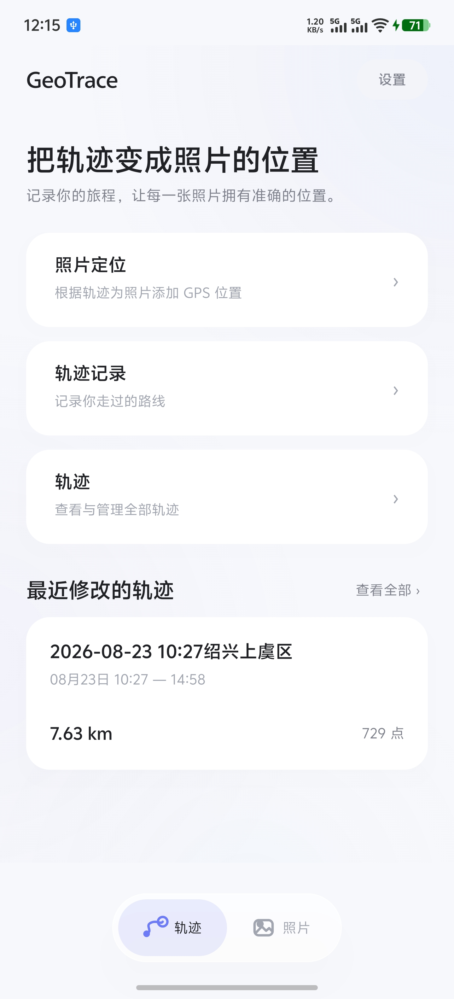</center>

### 记录轨迹

打开 GeoTrace 开始记录，锁屏也能持续定位。

<center>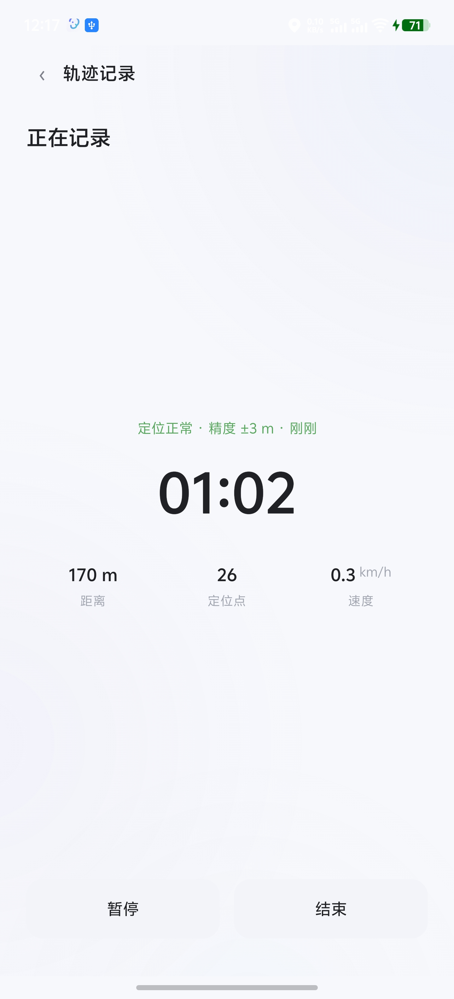</center>

### 查看轨迹详情

真实轨迹折线、距离、定位点数、来源，以及轨迹上已定位的照片。

<center>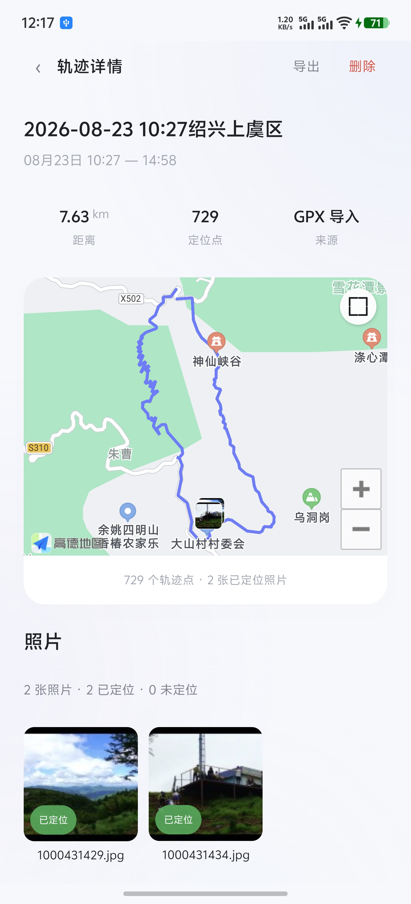</center>

### 添加照片

按相册浏览，多选相机照片；已添加的照片统一管理。

| 添加照片 | 已添加内容 |
|---|---|
| 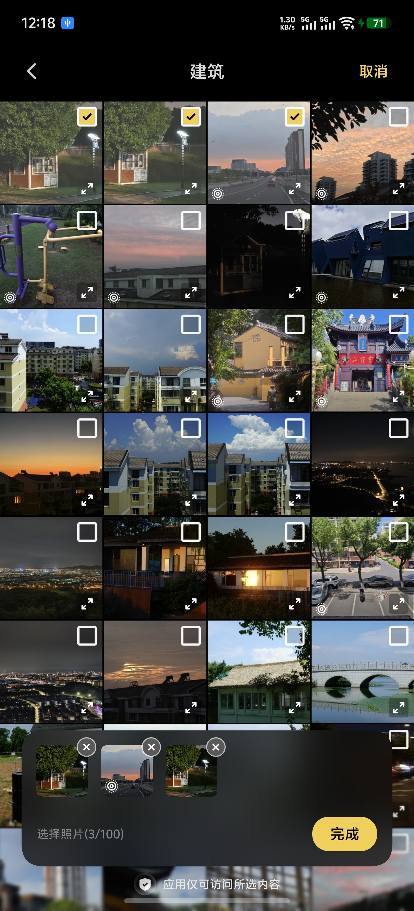 | 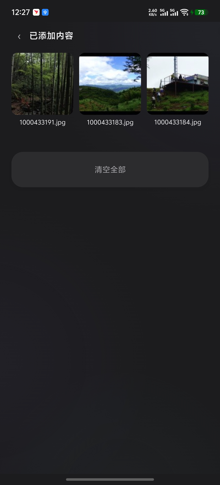 |

### 自动匹配定位

按拍摄时间匹配轨迹，逐张给出匹配结果与坐标，副本安全保存。

<center>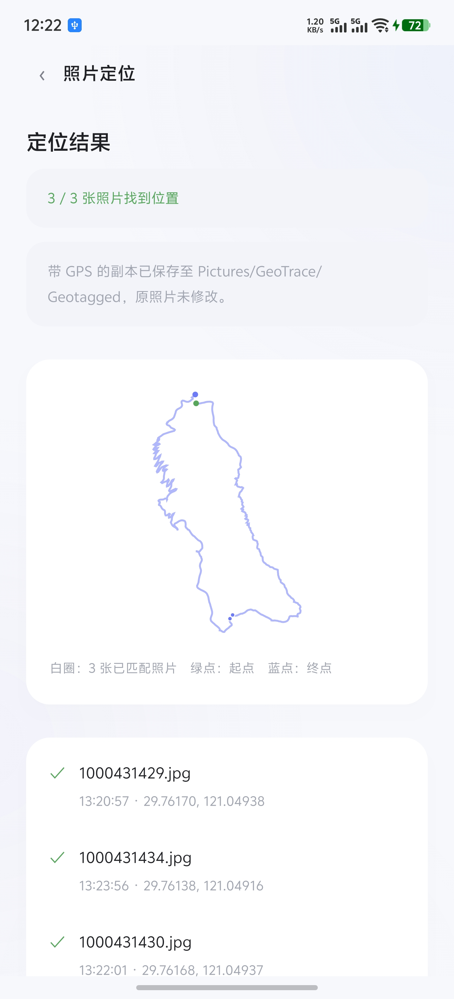</center>

### 照片详情与定位结果

高清预览、完整 EXIF、拍摄时间、地址、经纬度与照片位置地图；也可以随时手动修改时间和位置。

<center>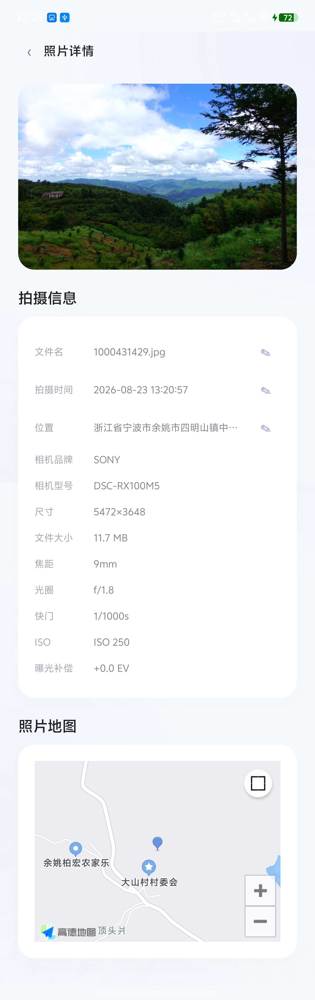</center>

### 手动地图选点

搜索地点或直接在地图上落点，随时修正照片位置。

<center>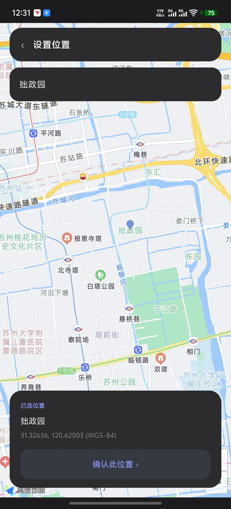</center>

### 设置

主题、时间偏移、最大匹配时间、GPS 记录间隔均可自行调整。

<center>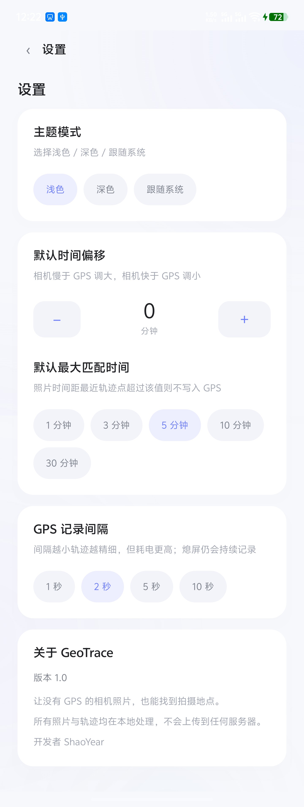</center>

### 深色模式

| 首页 · 轨迹 | 首页 · 照片 | 轨迹详情 |
|---|---|---|
| 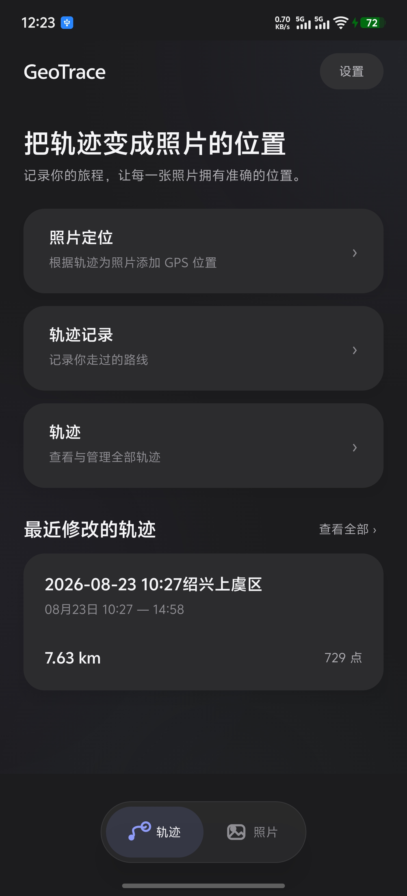 | 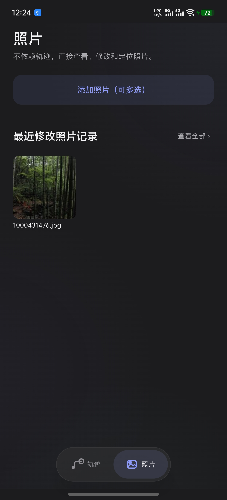 | 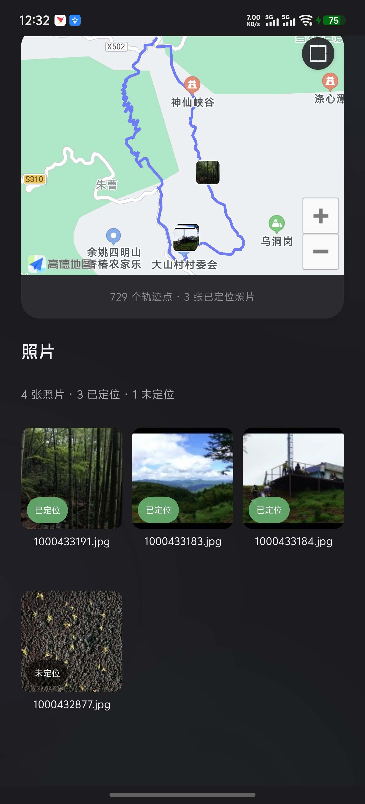 |

---

## 使用方法

完整图文说明见 **[使用文档 →](docs/usage.md)**

1. 出门前打开 GeoTrace 开始记录 GPS 轨迹，正常锁屏放包里；
2. 旅途中用相机正常拍照；
3. 回家后把照片添加到 GeoTrace（相册多选 / 文件夹）；
4. 选择对应轨迹，一键按拍摄时间自动匹配；
5. 在照片详情查看经纬度、地图与 EXIF；
6. 个别照片可用地图手动选点修正。

---

## 权限说明

| 权限 | 用途 |
|---|---|
| 位置权限（精确位置） | 记录 GPS 轨迹点 |
| 后台位置权限 | 锁屏 / 切后台时继续记录轨迹 |
| 通知权限 | 前台记录服务的状态通知（Android 13+） |
| 照片 / 媒体权限 | 读取你主动选择的照片及其 EXIF；优先使用系统照片选择器，可仅授权所选照片 |

所有权限仅用于实现上述功能。GeoTrace 不收集、不上传照片与轨迹数据；地图瓦片与地点搜索由高德地图 SDK 提供（仅在你使用地图功能时发起网络请求）。

---

## 下载

**最新版本：v1.1.0**

- **[下载 GeoTrace-v1.1.0.apk](https://github.com/ShaoYear/geotrace/releases/download/v1.1.0/GeoTrace-v1.1.0.apk)**
- 查看 [v1.1.0 Release 说明](https://github.com/ShaoYear/geotrace/releases/tag/v1.1.0)
- 查看 [全部版本 Tags](https://github.com/ShaoYear/geotrace/tags)
- 系统要求：Android 8.0 及以上（minSdk 26 / targetSdk 36）
- 安装时如提示「未知来源」，请在系统设置中允许当前浏览器或文件管理器安装应用

---

## 许可证

本项目**不开放源代码**。应用与发布材料版权归开发者所有，详见 [LICENSE](LICENSE)。
